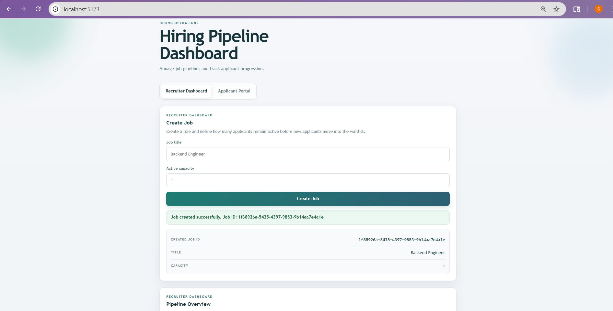
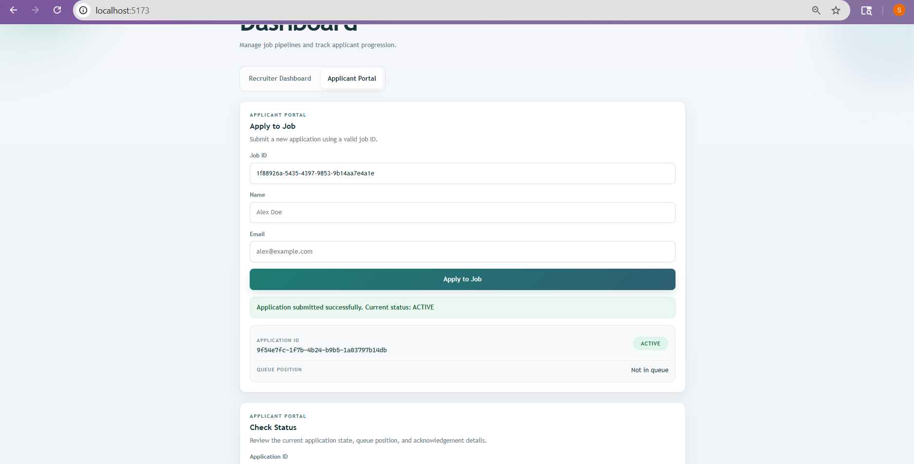
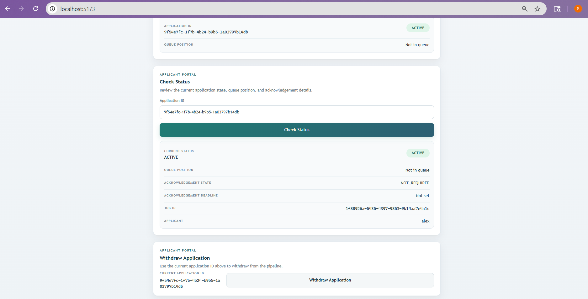
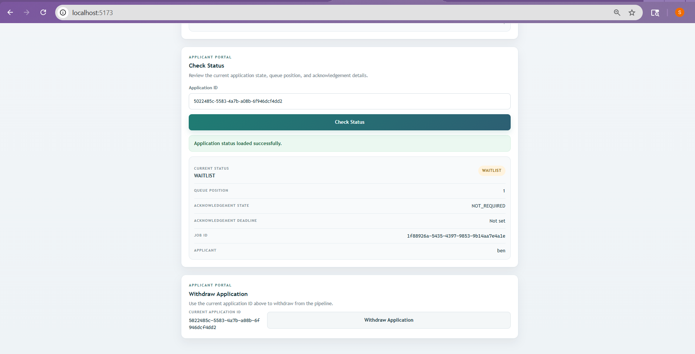
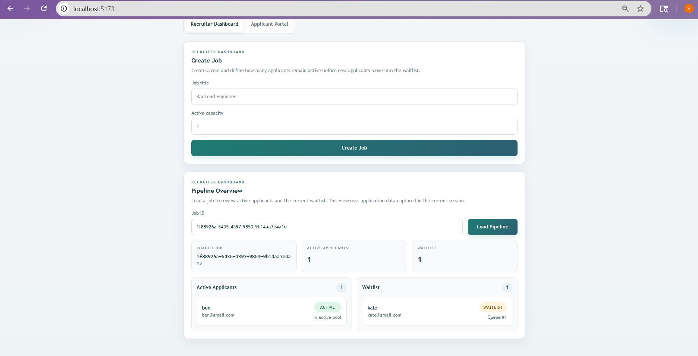
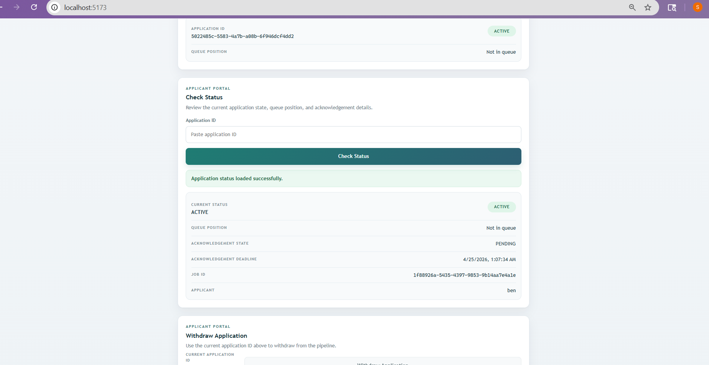

# Next In Line — A Deterministic Hiring Pipeline

## 📌 Problem Context

Small engineering teams often rely on spreadsheets to manage hiring pipelines. This leads to:

* poor visibility into applicant states
* manual tracking of waitlisted candidates
* delays in follow-ups
* no consistent progression logic

The goal is to build a **lightweight system** where the pipeline manages itself — without manual intervention.

---

## 💡 Solution Overview

This system enforces a **capacity-constrained hiring pipeline**:

* A fixed number of applicants remain **ACTIVE**
* Additional applicants enter a **WAITLIST**
* When a slot opens, promotion happens automatically
* The system maintains strict ordering and fairness

---

## 🧠 Core Model

```
            APPLIED
               │
     ┌─────────┴─────────┐
     │                   │
 (capacity free)   (capacity full)
     │                   │
   ACTIVE            WAITLIST
     │                   │
 (exit / decay)     (promotion)
     │                   │
    EXITED ◄────────── ACTIVE
```

---

## ⚙️ Key Features

### Capacity-Based Control

Each job defines an `activeCapacity`.

* If space exists → applicant becomes `ACTIVE`
* Otherwise → applicant enters `WAITLIST`

---

### Deterministic Queue Ordering

Waitlist ordering is based on:

* `waitlist_eligible_at`
* `queue_token`
* `id` (tie-breaker)

This ensures:

* fairness
* consistency
* predictable behavior

---

### Automatic Promotion

When an active applicant exits:

```
ACTIVE → EXITED → next WAITLIST → ACTIVE
```

Handled internally via the promotion loop.

---

### Exit Behavior

Exit is treated as a **terminal state**:

* Applicant is removed permanently
* Not reinserted into the queue

This avoids:

* reordering exploits
* infinite loops
* inconsistent states

---

### Applicant Visibility

Applicants can view:

* current status
* queue position
* acknowledgement state

---

## 🔐 Concurrency Handling

When multiple applications target the last available slot:

* Row-level locks are used (`SELECT ... FOR UPDATE`)
* Only one transaction succeeds at a time
* Others wait and re-evaluate state

This guarantees:

* no over-allocation
* consistency under concurrent requests

---

## 🧾 Audit Logging

Every state transition is recorded:

* APPLIED → WAITLIST
* WAITLIST → ACTIVE
* ACTIVE → EXITED
* ACTIVE → WAITLIST (decay)

Each log captures:

* previous state
* next state
* timestamp
* metadata

This allows full reconstruction of the pipeline history.

---

## ⏳ Inactivity Decay

When a waitlisted applicant is promoted:

```
ACTIVE + PENDING ACK
```

If not acknowledged within a defined window:

```
ACTIVE → WAITLIST (penalized position)
Next WAITLIST → ACTIVE
```

This keeps the pipeline moving without manual follow-up.

---

## 🌐 API Overview

### Jobs

* `POST /jobs`

### Applications

* `POST /jobs/:jobId/applications`
* `GET /applications/:id/status`
* `POST /applications/:id/acknowledge`
* `POST /applications/:id/exit`

---

## 🖥️ Frontend

Minimal by design:

* **Recruiter Dashboard**

  * Create job
  * View pipeline

* **Applicant Portal**

  * Apply
  * Check status
  * Withdraw application

The frontend is intentionally **not real-time**.
State updates are reflected on user-triggered actions to keep the system simple and predictable.

---

## ⚙️ Tech Stack

* PostgreSQL
* Node.js + Express
* React

No external queueing systems are used — all logic is implemented internally.

---

## ✅ Requirement Mapping

* Capacity control → job.activeCapacity
* Waitlist handling → WAITLIST state
* Auto-promotion → internal promotion loop
* Applicant visibility → status API
* Concurrency → row-level locking
* Logging → audit events
* Inactivity decay → acknowledgement + penalty requeue

---

## ⚖️ Tradeoffs

* No real-time updates (simpler, deterministic UI)
* Exit treated as terminal (avoids queue manipulation)
* Internal queue logic over external tools (full control)

---

## 🔄 Future Improvements

* Full recruiter view (all applicants per job)
* Better acknowledgement UI
* Pagination for large datasets
* Metrics (conversion, drop-offs)

---

## 🧪 Running Locally

```bash
# Backend
npm install
node src/app.js

# Frontend
cd frontend
npm install
npm run dev
```

---

## 📸 Screenshots

### Recruiter Dashboard


---

### Applicant Applying




---

### Queue Behavior


---

### Promotion & Acknowledgement


